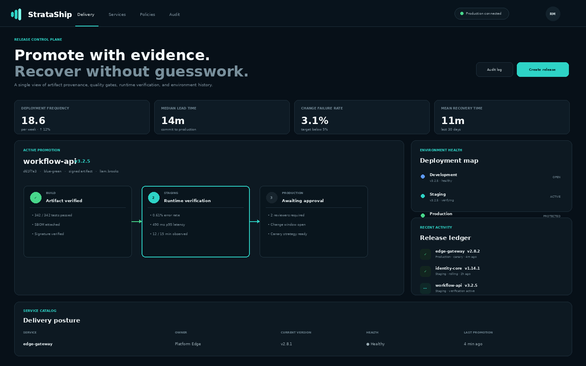
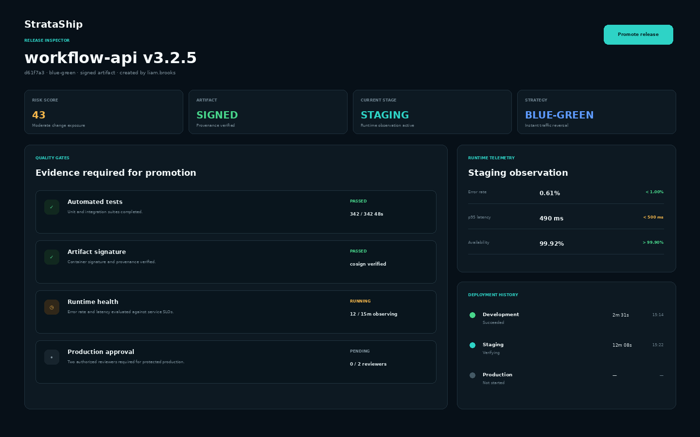
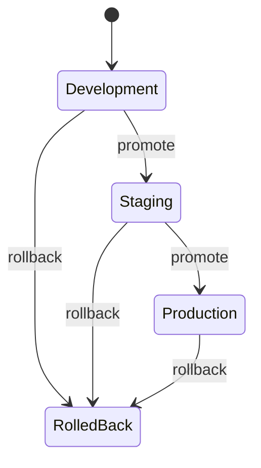
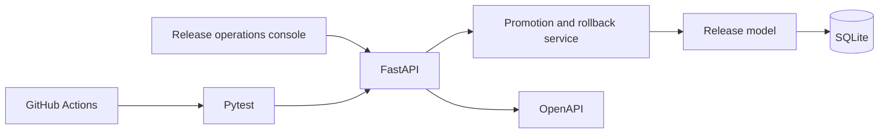
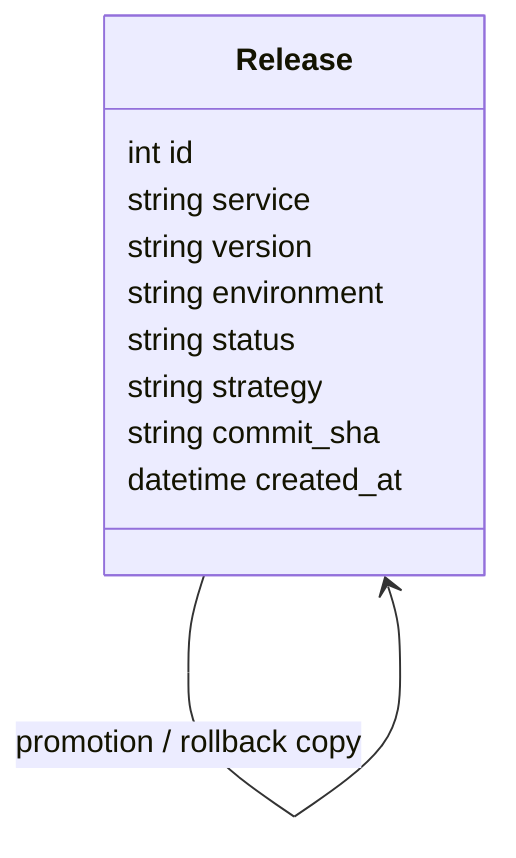

<div align="center">

# StrataShip

### A release control plane for promotion history, deployment strategy, and recoverable delivery.

[](https://github.com/abdullahijaz5961/strataship-delivery-platform/actions/workflows/ci.yml)


**Release operations** · **Environment promotion** · **Rollback records** · **FastAPI**

</div>



## The delivery problem

A deployment is more than a version number. Teams need to know which service changed, which commit produced the release, where it is running, which rollout strategy was selected, and how recovery was handled. StrataShip collects that information into an append-only release history instead of scattering it across terminal output and chat messages.

The current implementation focuses on the control-plane fundamentals: create a release, promote it from development to staging and then production, record the chosen strategy, and create a rollback record without deleting the original history.

## Release control surface

- **Release inventory** containing service, semantic version, environment, strategy, commit SHA, and status.
- **Environment promotion** that derives the next valid target from the current release state.
- **Multiple delivery strategies** represented explicitly as `rolling`, `canary`, or `blue-green`.
- **Controlled rollback** that appends a `rolled_back` release record for investigation.
- **Delivery overview** with service count, production health, verification queue, and deployment frequency.
- **Searchable operations console** backed by the REST API with polished local fixtures for static review.



## Promotion semantics



Promotion does not overwrite a release. The service clones the relevant artifact metadata into a new environment record. This creates a simple but useful audit trail: the same version and commit can be followed across stages, and a rollback remains visible as a separate operational event.

## Technical architecture





The compact release model keeps the behavior easy to inspect. Promotion rules live in the service layer, request validation is handled by Pydantic, and persistence remains isolated behind SQLAlchemy.

## API contract

| Method | Endpoint | Responsibility |
|---|---|---|
| `GET` | `/api/releases` | List the complete release history |
| `POST` | `/api/releases` | Create a release in a valid environment |
| `POST` | `/api/releases/{id}/promote` | Promote development → staging → production |
| `POST` | `/api/releases/{id}/rollback` | Append a rollback record |
| `GET` | `/api/summary` | Retrieve delivery indicators |
| `GET` | `/health` | Confirm API readiness |

Promote release `3` to its next environment:

```bash
curl -X POST http://localhost:8000/api/releases/3/promote
```

Create a release:

```bash
curl -X POST http://localhost:8000/api/releases \
  -H "Content-Type: application/json" \
  -d '{"service":"billing-api","version":"1.7.0","environment":"development","strategy":"canary","commit_sha":"d51a2bc"}'
```

## Local runtime

```bash
docker compose up --build
```

| Surface | URL |
|---|---|
| Release console | `http://localhost:5173` |
| API | `http://localhost:8000` |
| Swagger UI | `http://localhost:8000/docs` |
| Health | `http://localhost:8000/health` |

Native backend setup:

```bash
cd backend
python -m venv .venv
# Windows: .venv\Scripts\activate
# macOS/Linux: source .venv/bin/activate
python -m pip install -r requirements.txt
python -m uvicorn app.main:app --reload
```

Frontend preview:

```bash
cd frontend
python -m http.server 5173
```

## Quality checks

```bash
cd backend
python -m pytest -q
cd ..
node --check frontend/assets/app.js
```

GitHub Actions runs both checks on pushes and pull requests so the repository exposes its verification status publicly.

## Repository structure

```text
.
├── backend/
│   ├── app/api/routes.py       # release commands and queries
│   ├── app/services.py         # seed data and copy-based transitions
│   ├── app/models.py           # persisted Release record
│   ├── app/schemas.py          # environment and strategy constraints
│   └── tests/
├── frontend/                   # release pipeline and service posture UI
├── docs/                       # architecture, API, roadmap, screenshots
├── .github/workflows/ci.yml
└── docker-compose.yml
```

## Engineering choices

**Promotion is append-only.** A new record is created for the target environment, preserving the previous stage.

**Rollback is observable.** Recovery creates a visible state rather than deleting or rewriting history.

**Strategy is part of the release contract.** Rolling, canary, and blue-green are validated inputs, not free-form labels.

## Roadmap

- [ ] Policy gates for protected production environments
- [ ] Artifact signatures and OCI registry provenance
- [ ] Deployment telemetry and health-check evidence
- [ ] Change-window enforcement and release approvals
- [ ] PostgreSQL persistence and immutable audit metadata

## Security, contribution, and license

Use `.env` only for local configuration and never commit credentials. See [`SECURITY.md`](SECURITY.md) for disclosure guidance and [`CONTRIBUTING.md`](CONTRIBUTING.md) for verification expectations.

Released under the [MIT License](LICENSE).
