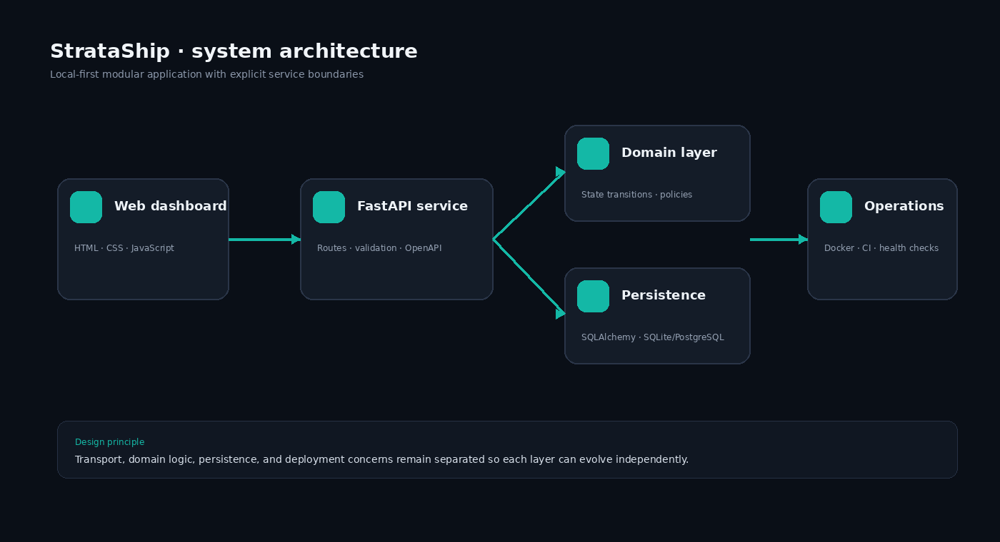

<div align="center">

# StrataShip

### A release control plane for safe, observable software delivery.


Track releases, promote verified builds, and perform controlled rollbacks across environments.

</div>




## Why this project exists

Teams frequently have CI pipelines but no clear operational view of what version is running, which checks passed, or how to recover safely. StrataShip provides a compact control plane for release visibility and disciplined state transitions.

## What is implemented

- Service and environment release inventory
- Release creation with validation checks
- Staging-to-production promotion workflow
- Controlled rollback records
- Deployment health overview
- Pipeline activity dashboard
- REST API, tests, Docker, and CI

## Architecture

```text
Browser (HTML/CSS/JavaScript)
      │ REST/JSON
      ▼
FastAPI application ── SQLAlchemy ── SQLite/PostgreSQL
      │
      ├── domain services
      ├── validation and state transitions
      └── health and operational endpoints
```

The repository separates transport, domain logic, persistence, and presentation. See [`docs/architecture.md`](docs/architecture.md) and the architecture decision record in [`docs/decisions`](docs/decisions).

## Technology

| Layer | Choice |
|---|---|
| Frontend | Semantic HTML, modern CSS, browser JavaScript |
| Backend | FastAPI, Pydantic, SQLAlchemy |
| Database | SQLite locally; PostgreSQL-compatible configuration |
| Quality | Pytest, GitHub Actions |
| Packaging | Docker, Docker Compose |

## Run with Docker

From the repository root:

```bash
docker compose up --build
```

Open:

- Web interface: `http://localhost:5173`
- API documentation: `http://localhost:8000/docs`
- Health endpoint: `http://localhost:8000/health`

## Run locally from VS Code

### Backend terminal

```bash
cd backend
python -m venv .venv
```

Windows PowerShell:

```powershell
.\.venv\Scripts\Activate.ps1
pip install -r requirements.txt
uvicorn app.main:app --reload
```

### Frontend terminal

```bash
cd frontend
python -m http.server 5173
```

## Verification

```bash
cd backend
pytest -q

cd ../frontend
node --check assets/app.js
```

## Repository map

```text
backend/        FastAPI application and tests
frontend/       Dependency-free web dashboard
docs/           Architecture, API, roadmap, screenshots
.github/        Continuous integration workflow
docker-compose.yml
```

## Engineering notes

The deployment adapter is simulated so the project is safe to run locally. The command boundary is explicit: real Kubernetes, Helm, or cloud deployment clients can replace the adapter without exposing infrastructure credentials to the frontend.

## Roadmap

Add GitHub webhooks, Helm releases, policy-as-code gates, and OpenTelemetry deployment markers.

## License

MIT License. See [`LICENSE`](LICENSE).
